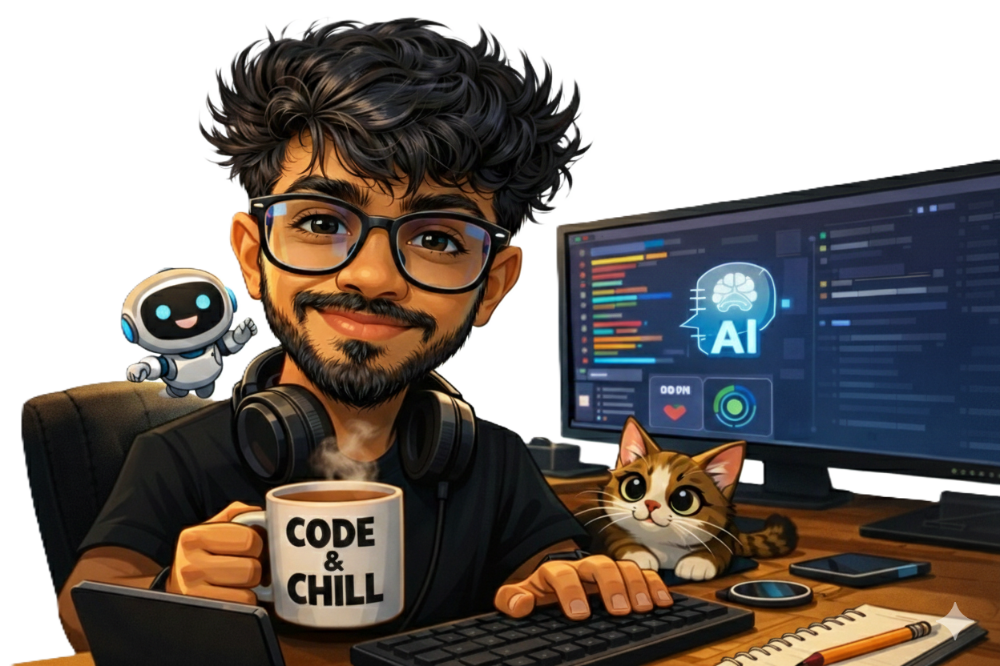
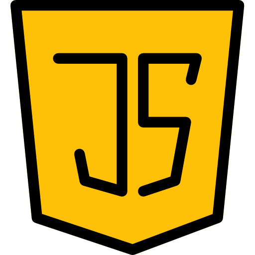
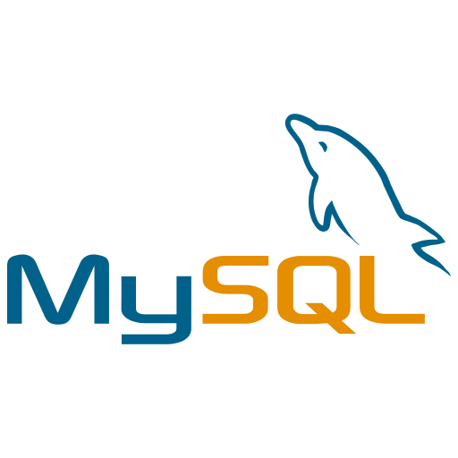
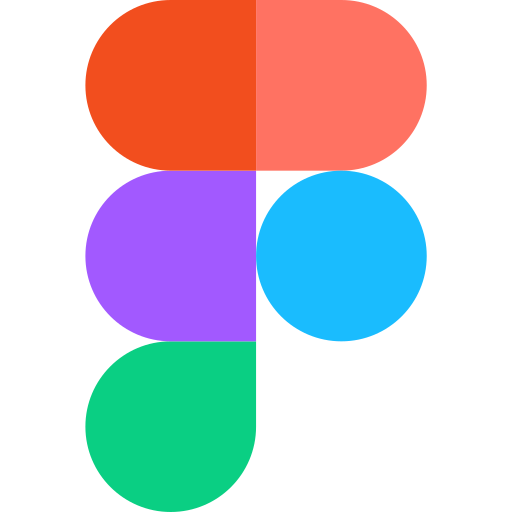

  

 
 

<h1 align="center">Hi 👋, I'm 𝐃𝐮𝐥𝐚𝐤𝐬𝐡𝐚𝐧𝐚 𝐑𝐮𝐤𝐬𝐡𝐚𝐧</h1>

<h3 align="center">
    
    </h3>

  

---
<h2>🖤 𝙰𝚋𝚘𝚞𝚝 𝙼𝚎...</h2>

<!-- 
  
 -->

 

💻 I’m a passionate IT undergraduate who loves turning ideas into real-world applications.  
🐍 Currently focused on becoming a professional Python developer.  
🚀 Constantly learning, building projects, and improving my problem-solving skills.  

I believe in:
- 🧠 Learning by doing  
- 🔥 Consistency over motivation  
- 🛠 Writing clean and maintainable code  
- 📈 Continuous self-growth  

🎯 **Goal:** To grow into a highly skilled software engineer and contribute to impactful technology solutions.

---
<!--               -->
   
<h2>🌐 𝚂𝚘𝚌𝚒𝚊𝚕𝚜:<h2>

  

---

 <b> 𝚂𝚔𝚒𝚕𝚕𝚜:</b> 

  <!-- Python -->
   

  <!-- Java -->
  

  <!-- HTML -->
  

  <!-- CSS -->
  

  <!-- JavaScript -->
  

  <!-- Github -->
  

  <!-- flutter -->
  

  <!-- tailwind -->
  
  
  <!-- boostrap -->
  
  
  <!-- postman -->
  

  

   

  <!-- jira -->
  

  <!-- mysql -->
  

  <!-- dbeaver -->
  

  <!-- figma -->
  

  <!-- postgres -->
  

---

  <b>🏆 𝙱𝚊𝚍𝚐𝚎𝚜: </b>

  
   

  

             
 

<h1 align="center">TᕼᗩᑎK YOᑌ ! ,❤️😊 </h1>
